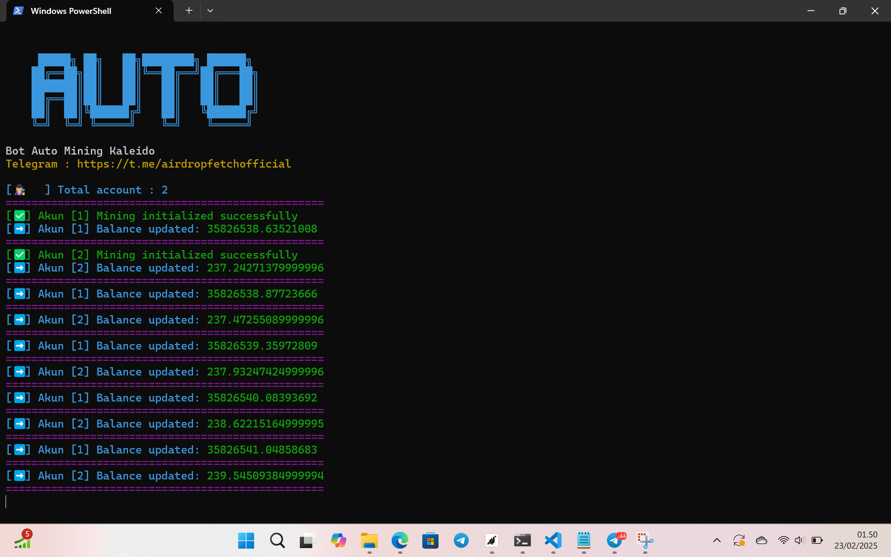

# kaleido-auto-bot

## ➡️ CHANNEL TELEGRAM JOIN HERE
[KLIK DISINI AIRDROP FETCH](https://t.me/airdropfetchofficial) 

## ➡️ Installation

1. Clone the repository:
```bash
git clone https://github.com/bangzx/kaleido-auto-bot.git
cd kaleido-auto-bot
pip install -r requirements.txt
python bot.py
```
## Edit file wallets.txt
file wallets.txt masukin wallet yang sudah daftar kaleido masukin 1 line 1 baris biar bisa run banyak wallet atau 1 wallet saja 


